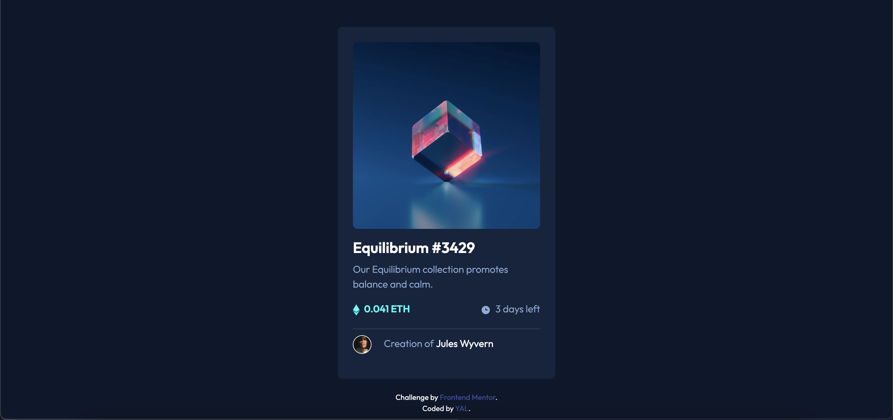
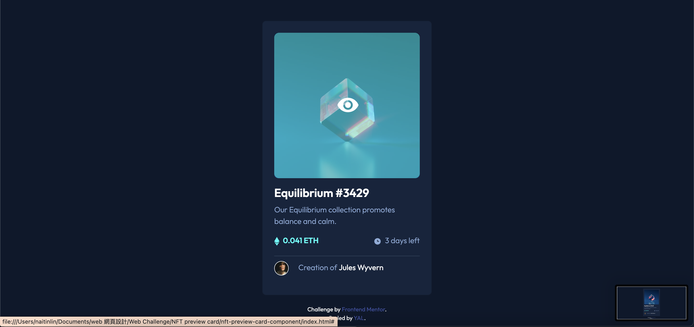

# Frontend Mentor - NFT preview card component solution

This is a solution to the [NFT preview card component challenge on Frontend Mentor](https://www.frontendmentor.io/challenges/nft-preview-card-component-SbdUL_w0U). Frontend Mentor challenges help you improve your coding skills by building realistic projects. 

## Table of contents

- [Overview](#overview)
  - [The challenge](#the-challenge)
  - [Screenshot](#screenshot)
  - [Links](#links)
- [My process](#my-process)
  - [Built with](#built-with)
  - [What I learned](#what-i-learned)
  - [Continued development](#continued-development)
- [Author](#author)
- [Acknowledgments](#acknowledgments)

## Overview
### The challenge
Users should be able to:
- View the optimal layout depending on their device's screen size
- See hover states for interactive elements

### Screenshot



### Links
- Live Site URL: 

## My process
### Built with
- Semantic HTML5 markup
- CSS custom properties
- Bootstrap

### What I learned
懸停 - hover
這次糾結在要用在哪個元素上，小腦袋瓜差點燃燒殆盡，
尤其懸停在照片上的樣式，好險方法是人想出來的（可能不是最好的）。

```html
<div class="hover">
  <a href="#">
    
    <div class="mask"></div>
    <div class="mask-img"></div>
  </a>
</div>
```
```css
.hover:hover .mask,
.hover:hover .mask-img {
    visibility: visible;
}

.mask {
    background-color: hsl(178, 100%, 50%);
    position: absolute;
    top: 24px;
    right: 24px;
    bottom: 242px;
    left: 24px;
    border-radius: 10px;
    opacity: 0.5;
    visibility: hidden;
}

.mask-img {
    position: absolute;
    text-align: center;
    top: 150px;
    right: 149px;
    visibility: hidden;
}
```

## Author
- Website - YAL
- Frontend Mentor - [@YAcodingroom]
(https://www.frontendmentor.io/profile/YAcodingroom)
- Threads - [@nt19_lya](https://www.threads.net/@nt19_lya)

## Acknowledgments
感謝Angela老師，感謝靜文老師，感謝Google，感謝Bootstrap，感謝宇宙，感謝自己的好學。
感謝另一半給我空間與時間，可以跟程式碼搏鬥（笑）。